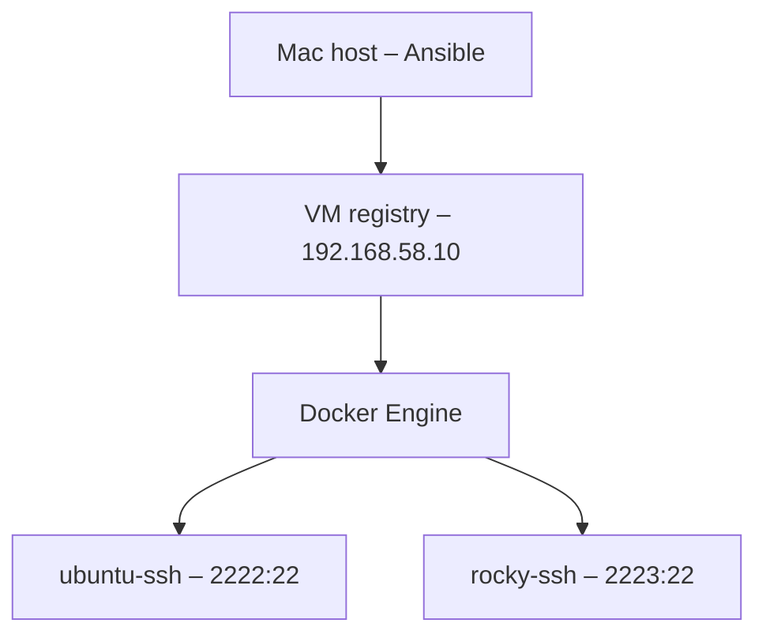

<h1 align="center">Step 2: Container SSH con Ansible</h1>

<p align="center">
  Creazione di immagini Ubuntu e Rocky Linux con Docker, SSH e autenticazione a chiave.
</p>

In questo step ho usato Ansible per costruire e avviare due container Linux
sull'host remoto `registry`.

> [!IMPORTANT]
> Ho eseguito i comandi Ansible e SSH dal **Mac host**, dalla root del
> repository.

## Obiettivo

- creare due immagini con sistemi operativi differenti;
- avviare `sshd` sulla porta `22`;
- consentire l'accesso a `genericuser` tramite chiave pubblica;
- abilitare `genericuser` all'uso di `sudo`;
- verificare build, container e collegamento SSH.

Per costruire le immagini ho usato due `Containerfile`. La sintassi è la stessa
del `Dockerfile` ed è compatibile sia con Docker sia con Podman.

## Architettura



## Struttura del progetto

```text
track-3/step_2/
├── 2-cont.yml
├── keys/
│   ├── id_key_genericuser
│   └── id_key_genericuser.pub
├── ubuntu/
│   └── Containerfile
│   └── id_key_genericuser.pub (copiata successivamente)
└── rocky/
    └── Containerfile
    └── id_key_genericuser.pub (copiata successivamente)

```

Ho mantenuto la chiave privata in `keys/`, senza copiarla nelle immagini. Il
playbook inserisce automaticamente una copia della chiave pubblica nei due
contesti prima della build.

## Configurazione

| Elemento | Ubuntu | Rocky Linux |
| --- | --- | --- |
| Base | Ubuntu 22.04 | Rocky Linux 9 |
| Immagine | `ubuntu-ssh:22.04` | `rocky-ssh:9` |
| Container | `ubuntu-ssh` | `rocky-ssh` |
| Autorizzazione sudo | regola `sudoers` NOPASSWD | regola `sudoers` NOPASSWD |
| Porta | `2222:22` | `2223:22` |

Sull'host `registry` viene rilevato Docker. Il playbook trasferisce i contesti di
build in `/opt/container-builds/`.

## Funzionamento

Il mio playbook:

1. genera una coppia RSA da 4096 bit;
2. copia la chiave pubblica nei contesti Ubuntu e Rocky;
3. trasferisce i contesti sull'host `registry`;
4. costruisce le due immagini;
5. avvia i container pubblicando le porte `2222` e `2223`.

Ho raccolto contesto, immagine, nome e porta nella variabile `containers`, che
riutilizzo nelle diverse task.

Nei due `Containerfile` ho applicato la stessa configurazione SSH:

```text
PermitRootLogin no
PasswordAuthentication no
PubkeyAuthentication yes
AllowUsers genericuser
```

La chiave pubblica viene salvata in `authorized_keys`. All'avvio ogni container
genera le proprie host key, controlla la configurazione con `sshd -t` e avvia
`sshd -D -e` in primo piano.

## Procedura

Controllare ed eseguire il playbook:

```bash
ansible-playbook track-3/step_2/2-cont.yml --syntax-check
ansible-playbook track-3/step_2/2-cont.yml
```

Il recap deve terminare con `failed=0`.

## Verifica

Controllare i container:

```bash
ansible registry -b -m command -a "docker ps"
```

Provare accesso SSH e `sudo`:

```bash
# Ubuntu
ssh -i track-3/step_2/keys/id_key_genericuser \
  -p 2222 genericuser@192.168.58.10 \
  'sudo -n id -u'

# Rocky Linux
ssh -i track-3/step_2/keys/id_key_genericuser \
  -p 2223 genericuser@192.168.58.10 \
  'sudo -n id -u'
```

Il risultato atteso per entrambi è `0`.

## Idempotenza

```bash
ansible-playbook track-3/step_2/2-cont.yml
```
Il playbook va eseguito più volte per controllarne l'idempotenza. Alla seconda
esecuzione non devono comparire errori e i task già conformi non devono
produrre modifiche.


